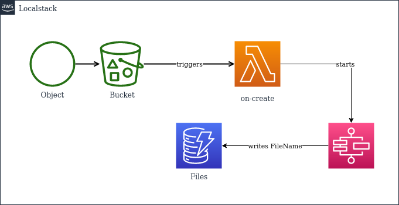

# Terraform assignment

Welcome to the Terraform assignment. In this assignment we kindly ask you to provision
some AWS resources by using Terraform. To be independent of any AWS accounts, we've prepared
a docker-compose configuration that will start the [localstack](https://github.com/localstack) 
AWS cloud stack on your machine. Terraform is already fully configured to work together with 
localstack. Please see the usage section on how to authenticate.

# Assignment



The practical use of the assignment shouldn't be questioned :-)

We'd like to track a list of files that have been uploaded. For this we require:
- A S3 Bucket to where we upload files
- A DynamoDb table called `Files` with an attribute `FileName`
- A Stepfunction that writes to the DynamoDb table
- A Lambda that get's triggered after a file upload and then executes the stepfunction.

# Usage

## Start localstack

```shell
docker-compose up
```

Watch the logs for `Execution of "preload_services" took 986.95ms`

## Authentication
```shell
export AWS_ACCESS_KEY_ID=foobar
export AWS_SECRET_ACCESS_KEY=foobar
export AWS_REGION=eu-central-1
```

## AWS CLI examples
### S3
```shell
aws --endpoint-url http://localhost:4566 s3 cp README.md s3://test-bucket/
```

## StepFunctions
```shell
aws --endpoint-url http://localhost:4566 stepfunctions list-state-machines
```

## DynamoDb

```shell
aws --endpoint-url http://localhost:4566 dynamodb scan --table-name Files
```
